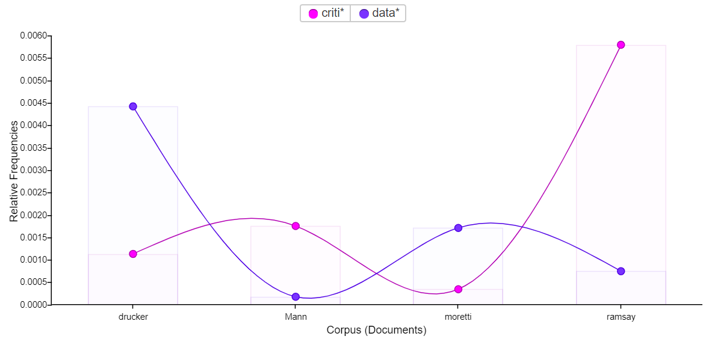

# Academic blog post - the Datasets of Digital Humanities

### Prompt:
##### Ramsay and Drucker's critique of Moretti should be taken to heart by digital humanists: any reliance on externally-produced data sets should be abolished in the field. Instead, each digital humanist will show the interpretive methods used to produce their unique data sets, and no two scholars will ever use the same data to conduct their research. Doing so will allow digital scholarship to fully embrace its humanities background, foregrounding subjective experience above all else. Established datasets are for scientists, and they have no place in humanities research. *All data should be interpretively created.*

The existence of unbiased 'raw data' is a debated topic in the humanities fields, and the digital humanities are no different. However, this argument is only a stepping stone to the actual debate at hand: should digital humanities scholars use other scholars' datasets, like one would with raw data, or be required to gather their own data, since every dataset is uniquely tailored to the methods of and reasons for its collection? My answer is to point out the unnecessarily black-and-white thinking of this question that we in the humanities should know better than to fall prey to. Discussing, critiquing, and using data collected (and therefore shaped) by someone else is not a mark of laziness or inherently tainted in and of itself; the real trap is only in using that dataset with the mindset that it is raw and unbiased data. What is concerningly missing from most uses of another scholar’s data is the critical analysis of that data in relation to how it is shaped and colored by the purpose it was gathered for, and how that bias affects both their original conclusions drawn from it and limits one’s ability to re-use that data for any other purpose.

The initial argument over whether there can even be raw, unbiased datasets in the humanities, is one that scholars are getting stuck on, rather than moving ahead to the concept of simply being aware of data's biases and acknowledging them. In his article "Graphs, Maps, Trees", Moretti states his stance in the digital humanities with, “Quantitative research provides a type of data which is ideally independent of interpretations… and that is of course also its limit: it provides *data*, not interpretation”, arguing the far opposite – that a dataset on its own suffers from the problem of being entirely unbiased and neutral, with no inherent analysis or interpretation embedded in it. This is an opinion that has spilled over from the science and math fields, where numerical data is seen as pure and empirical and its roots are not worth talking about when the critical analysis is focused on the data’s interpretation. 

In direct opposition, Drucker echoes my own thoughts when she says, “…the representation of knowledge is as crucial to its cultural force as any other facet of its production” ("Humanities Approach to Graphical Display"), talking about the deceptive bias in visual presentation of data and how it is important to acknowledge and discuss the weaknesses, limitations, and biases of data’s display as well as its collection or production. She doesn’t claim that graphs or other methods of visually displaying data are inherently evil or inaccurate – her point is simply that graphical displays seem to be a weak point in the humanities where suddenly everyone turns off their critical analysis skills upon seeing a graph of data rather than a written summary, taking the interpretation as fact rather than an interpretation shaped by the scope and biases of the data. My point, similarly, is that scholars seem to be getting stuck on the distracting argument of whether or not humanities data is unbiased, rather than using those same analytical skills to explore and take into consideration the limitations of their gathered or borrowed datasets when they use them.

To take it one step further, Ramsay has a book in which he talks about this distracting argument coming from the introduction of computers and computing into the humanities, bringing the ideas of applying scientific views and methods to a space that should be defined by humanistic study (*Reading Machines: Toward an Algorithmic Criticism*). As I mentioned, the idea of data being ‘raw’ and unbiased has come to humanities from the math and science fields, and the growth of humanities computing becoming an injection site by way of the computer itself has a ring of truth to it. Computers organize and display data, but we characterize computers as number-crunching, fact-distributing machines, and what we get from a computer (even if the computer is only organizing and displaying the data) has the air of pure, raw, scientific data, much in the same way that graphs do according to Drucker. In a recent article by Mann, "How Technology Means: Texts, History, and Their Associated Technologies", he talks about computing’s inherent impact on data through the lens of recording and preserving historical artifacts with technology: “…technologies used to study and represent the past are not hermeneutically neutral…it is important to remember that the past is only ever approximately apprehended: one cannot simply “go back,” but must rely on constructed memories, artifacts, written accounts, recordings, etc”, reinforcing my argument that organizing or collecting humanities data with computers does not change the data’s inherent biases or limitations.

However, that also highlights my point about data being influenced by the people it’s collected by, what methods they use, and what purpose they’re collecting it for – a concern that should be universal, throughout all disciplines, not only in the digital humanities and not through the lens that introducing computers to the humanities means we should (or should not) treat computer-stored or organized data as anything other than the flawed, human-collected data that it is. While Mann reminds us that technology that displays facts from the past is not neutral, the greater focus should be placed on the fact that it is still human beings that have chosen to record, and then inputted, the data into the technology to store or collate it. It’s then people who then decide how the data is organized and then make meaning from what they see – all things that can and have been done with or without computers being the tool used to store and display data. Choosing a digital tool requires more awareness of how it’s organizing data and how that organization does not necessarily create meaning or reveal information, only allowing us to better see patterns that still require critical analysis and awareness of what influences have acted upon them.

Figure 1:
Use of the words data* (including datasets, etc) vs criti* (including critical, criticism, etc) in Moretti, Drucker, Ramsay, and Mann (using voyant-tools.org)

Patterns can confirm or conflict with our personal theories, or even both at the same time. Patterns made easy to see with visualizations are particularly vulnerable to this kind of ambiguous twisting, which is Drucker’s primary concern. In Figure 1, you can clearly see that the data shows a clear division between several of the works I’ve cited here, where authors either focused on the purity (or lack thereof) of datasets OR the importance on critical thinking and analysis of information rather than anything inherent to the base data, instead talking about the issue as a whole as well as the solution. They speak at length about one topic rather than the influence of critical thinking and analysis on data and how the two interact with one another, showing that each of these texts alone do not capture the full scope of the issue at hand and instead get distracted by the question of data purity.

Or… IS that was Figure 1 shows?  Everything I just said is completely made up and not reflected in the graph at all. The only thing Figure 1 actually shows is that authors used words including the fragment of ‘data’ or ‘criti’ in different amounts. As a visualization of the number of times a phrase appears in a document, that is the only data shown by the graph. It says nothing about whether Drucker is praising or criticizing data, just that she uses the fragment more than ‘criti’. It does not show whether Ramsay is talking about critical thinking, critical analysis, critical problems, criticism, overly-critical judgements, or any other phrase that includes ‘criti’. If someone were to interact with my arguments and do further research of their own, they could include my ‘raw data’ as part of their research – but my raw data is the texts themselves, not Figure 1, and they should endeavor to both include critical analysis of why they include my data and its influences and limitations, as well as generate their own information and visualizations.

Any analysis or interpretation of data is only as good as its acknowledgement of the data’s limitations and biases. Figure 1 paints an interesting picture – but of what? There is no single meaning or theory that this graph proves. The actual data this graph is built on consists of four plain text documents that are translations of the four articles I’ve mentioned, and those translations have their limitations in going from PDF to plain text. Words may have been missed or transcribed incorrectly, or used in ways that my wildcard search wasn’t equipped to include. Just like those things are important for me to mention when I use this graph, it would be important for another scholar to mention those limitations and biases if using my graph in their own article – and just so, it is important to acknowledge them still if they were to use my ‘raw data’ text files in a graph of their own. The argument of whether humanities data can be raw or not is misleading when, as humanities scholars, we simply need to remember our roots and be transparent about the scope and biases of our data.

#### Works Cited

Drucker, Johanna. "Humanities Approaches to Graphical Display." *Digital Humanities Quarterly,* vol. 5, no. 1, 2011, www.digitalhumanities.org/dhq/vol/5/1/000091/000091.html. Accessed 16 Mar. 2019.

Mann, Joshua L. "How Technology Means: Texts, History, and Their Associated Technologies." *Digital Humanities Quarterly,* vol. 13, no. 3, 2018, www.digitalhumanities.org/dhq/vol/12/3/000398/000398.html. Accessed 16 Mar. 2019.

Moretti, Franco. "Graphs, Maps, Trees." *New Left Review*, no. 24, 2003, newleftreview.org/issues/II24/articles/franco-moretti-graphs-maps-trees-1. Accessed 16 Mar. 2019.

Ramsay, Stephen. *Reading Machines: Toward an Algorithmic Criticism.* University of Illinois Press, 2011.
